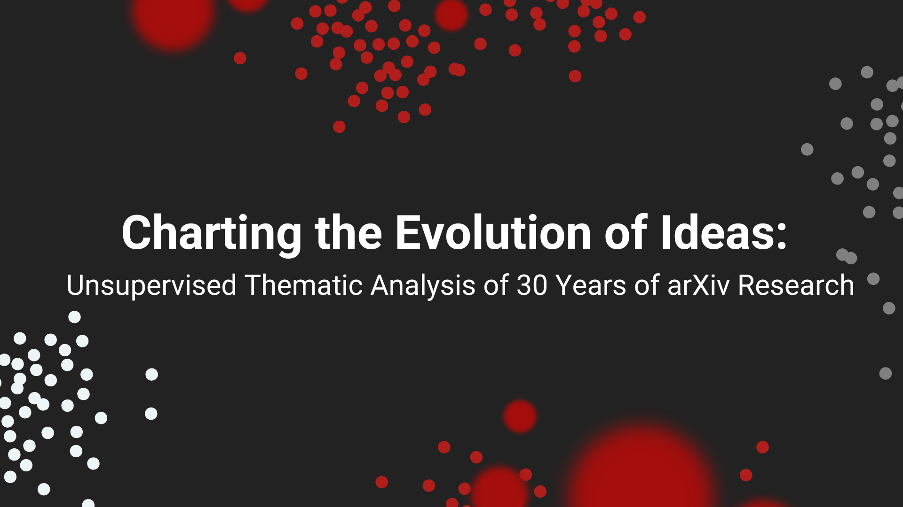

<h1>
  
</h1>

<h1>Authors</h1>
Paula Martinez, Joshua Simon

<h1>Project Description</h1>
This project explores the evolution of academic research themes across multiple disciplines over the past 30 years, from 1995 to 2024. By applying unsupervised clustering techniques to a large corpus of preprint articles from the arXiv repository, the study uncovers patterns of thematic convergence, divergence, and interdisciplinary interactions within fields such as mathematics, physics, computer science, and statistics.

<h1>Key Takeaways</h1>
<ol>
  <li>The clustering techniques produced thematically coherent but potentially granular subgroups within the broader mathematics, statistics, and computer science themes, as indicated by domain-specific terms.</li> 
  <li>While the 250 sample case had balanced cluster distributions, the 500 sample case showed an asymmetry, suggesting more detailed subgroups within the larger statistical methods/theory cluster.</li> 
  <li>Statistics remained a consistently relevant theme, with shifts between theory and applications. Computer science exhibited more transformative evolution, driven by technological advances, interdisciplinary nature, and practical applications.</li>
</ol>
